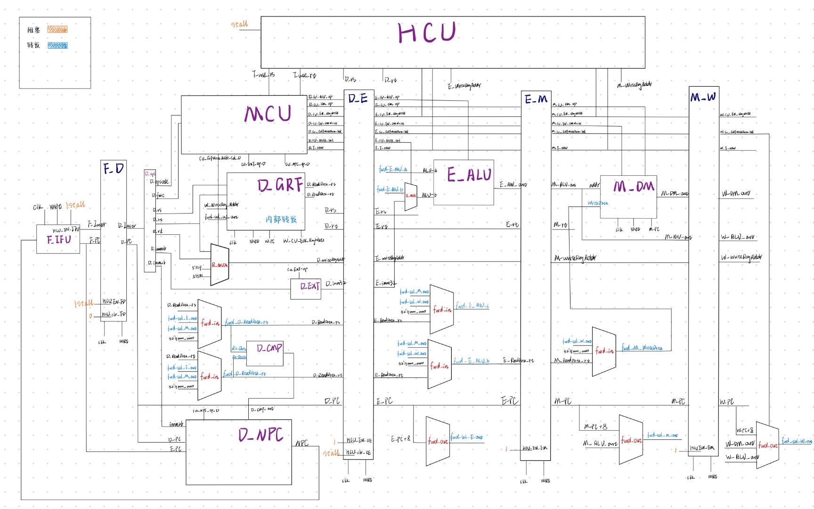

# P5 流水线CPU设计草稿

---

## 思考题：

#### Q1：

- 如下面这种情况，若beq的结果在E级产生，则不需要暂停，可以转发，但是现在beq在D级的时候lw还在M级，没有产生结果，需要暂停。

```
lw    $t0, 0($0)
nop
beq   $t0, $t0, label
```

#### Q2：

+ 因为延迟槽的存在，跳转指令的后一条必然会进入流水线并执行，所以把PC+8写入寄存器，避免jr后延迟槽内的指令会再执行一次

#### Q3：

- 来自寄存器的值是当前这一级的值，而功能部件输出的值是要写入下一级的，有一定的延迟，不能统一时间，转发的值就不稳定

#### Q4：

+ 为了保持W级的写入和此时D级的读出是同一个值，规避数据冒险。
+ 实现方法就是在GRF模块里加上一个MUX，判断当冲突条件满足时转发：

```verilog
    assign D_ReadData_rs = (RegAddr_rs == 5'b00000) ? 32'H0000_0000 : 
                           (WriteRegAddr == RegAddr_rs && CU_EN_RegWrite == 1) ? WriteData :
                                                                                 register_32[RegAddr_rs];
    assign D_ReadData_rt = (RegAddr_rt == 5'b00000) ? 32'H0000_0000 : 
                           (WriteRegAddr == RegAddr_rt && CU_EN_RegWrite == 1) ? WriteData :
                                                                                 register_32[RegAddr_rt];
```

#### Q5：

- 需求者有：
	- NPC：ra_Data
	- CMP：rs_Data， rt_Data
	- ALU：ALU_a, ALU_b
	- DM：writeData
- 供给者：
	- PC+8, E_ALU_out, M_DM_out
- 共有转发数据通路：**每一级上加上一个outMUX，用于选择转发回去的结果，选择信号每条指令不同**；在每个需求者端口前加上forward_MUX，用于接收来自E, M, W三级的转发。

#### Q6：

+ 计算类：首先改变MCU，注意控制信号与指令相对应；再改ALU的结构，增加输出选择
+ 访存类：改变MCU + ALU + DM 相应的功能（可能还要改变相应的数据通路）
+ 跳转类：修改MCU + ALU + NPC相应功能 （可能还要改变相应的数据通路）

#### Q7：

+ 选择的是——集中式译码
+ 优势：不需要编写多个译码器；不足：流水线寄存器臃肿
+ 架构：见代码

---

## 设计思路

### 命名规则：

+ 模块命名：模块之前加上FDEMW级，按流水级分类
+ 数据通路输出信号命名：名称前加上流水级，利于连线
+ MCU控制信号流水命名：CU产生的信号前加上 `CU_`，后面加上流水级
+ stall控制的信号前加`HCU_`
+ 转发（供给者）的信号前加`Fwd_sel_` ; 转发/校正（需求者）后的信号前加`Fwd_`

---

### 模块设计：

##### 基础数据通路：

###### F_IFU:

| 信号       | 方向 | 位宽 | 描述                   |
| ---------- | ---- | ---- | ---------------------- |
| clk        | I    | 1    | 时钟信号               |
| reset      | I    | 1    | 同步复位               |
| HCU_EN_IFU | I    | 1    | 使能信号               |
| NPC        | I    | 32   | 下一条被执行指令的地址 |
| F_Instr    | O    | 32   | 输出寻到的指令         |
| F_PC       | O    | 32   | 当前执行指令的地址     |

###### D_CMP:

| 信号      | 方向 | 位宽 | 描述                       |
| :-------- | :--- | :--- | :------------------------- |
| rs_Data   | I    | 32   | 待比较数据rs               |
| rt_Data   | I    | 32   | 待比较数据rt               |
| D_CMP_out | O    | 1    | 1：分支跳转<br />0：不跳转 |

###### D_EXT：

| 信号      | 方向 | 位宽 | 描述                        |
| --------- | ---- | ---- | --------------------------- |
| imm16     | I    | 16   | 16位立即数                  |
| CU_EXT_op | I    | 1    | 0: 零拓展 <br />1: 符号拓展 |
| D_imm32   | O    | 32   | 拓展后的32位立即数          |

###### D_GRF:

| 信号           | 方向 | 位宽 | 描述                           |
| -------------- | ---- | ---- | ------------------------------ |
| clk            | I    | 1    | 时钟信号                       |
| reset          | I    | 1    | 同步复位                       |
| CU_EN_RegWrite | I    | 1    | 写使能信号，有效时将数据写入   |
| RegAddr_rs     | I    | 5    | 将RA1地址的寄存器的数据读到RD1 |
| RegAddr_rt     | I    | 5    | 将RA2地址的寄存器的数据读到RD2 |
| WriteRegAddr   | I    | 5    | 将数据写入的寄存器的地址       |
| WriteData      | I    | 32   | 写入的数据                     |
| PC             | I    | 32   | 作为输出的PC                   |
| D_ReadData_rs  | O    | 32   | 输出RA1地址的寄存器的数据      |
| D_ReadData_rt  | O    | 32   | 输出RA2地址的寄存器的数据      |

###### D_NPC：

| 信号      | 方向 | 位宽 | 描述                                                         |
| :-------- | :--- | :--- | :----------------------------------------------------------- |
| F_PC      | I    | 32   | F级指令的地址                                                |
| D_PC      | I    | 32   | D级指令的地址                                                |
| imm26     | I    | 26   | 26位地址偏移                                                 |
| ra_Data   | I    | 32   | 储存在31号寄存器中的数据                                     |
| CMP_out   | I    | 1    | B类指令的比较结果                                            |
| CU_NPC_op | I    | 3    | 000：PC + 4 <br />001：B类跳转 <br />010：jal / j <br />011：jr |
| D_NPC     | O    | 32   | 下一条指令地址                                               |

###### D_Splitter:

| 信号     | 方向 | 位宽 | 描述   |
| -------- | ---- | ---- | ------ |
| Instr    | I    | 32   | 指令   |
| D_opcode | O    | 6    | opcode |
| D_rs     | O    | 5    | rs     |
| D_rt     | O    | 5    | rt     |
| D_rd     | O    | 5    | rd     |
| D_func   | O    | 6    | func   |
| D_imm16  | O    | 16   | imm16  |
| D_imm26  | O    | 26   | imm26  |

###### E_ALU:

| 信号      | 方向 | 位宽 | 描述        |
| :-------- | :--- | :--- | :---------- |
| ALU_a     | I    | 32   | 运算数a     |
| ALU_b     | I    | 32   | 运算数b     |
| CU_ALU_op | I    | 4    | ALU功能选择 |
| E_ALU_out | O    | 32   | 计算结果    |

###### M_DM:

| 信号          | 方向 | 位宽 | 描述                                      |
| :------------ | :--- | :--- | :---------------------------------------- |
| clk           | I    | 1    | 时钟信号                                  |
| reset         | I    | 1    | 同步复位                                  |
| CU_EN_DMWrite | I    | 1    | 写使能信号                                |
| addr          | I    | 32   | 待操作数据的地址                          |
| writeData     | I    | 32   | 待写入的数据                              |
| CU_DM_op      | I    | 2    | 000: word <br>001: byte <br>010: halfword |
| PC            | I    | 32   | 作为输出的PC                              |
| M_DM_out      | O    | 32   | 输出的32位数据                            |

##### 流水线寄存器：

###### F_D(IF/ID)：

| 信号       | 方向 | 位宽 | 描述                   |
| :--------- | :--- | ---- | :--------------------- |
| clk        | I    | 1    | 时钟信号               |
| reset      | I    | 1    | 同步复位               |
| HCU_EN_FD  | I    | 1    | 使能信号               |
| HCU_clr_FD | I    | 1    | 刷新信号（清空延迟槽） |
| F_Instr    | I    | 32   | F级取出的指令          |
| F_PC       | I    | 32   | F级输出的指令PC        |
|            |      |      |                        |
| D_Instr    | O    | 32   | D级当前指令            |
| D_PC       | O    | 32   | D级当前指令地址        |

###### D_E(ID/EX)：

| 信号                  | 方向 | 位宽 | 描述                 |
| :-------------------- | :--- | :--- | :------------------- |
| clk                   | I    | 1    | 时钟信号             |
| reset                 | I    | 1    | 同步复位             |
| HCU_EN_DE             | I    | 1    | 使能信号             |
| HCU_clr_DE            | I    | 1    | 刷新信号（产生气泡） |
| D_ReadData_rs         | I    | 32   | rs的值               |
| D_ReadData_rt         | I    | 32   | rt的值               |
| D_rs                  | I    | 5    | rs                   |
| D_rt                  | I    | 5    | rt                   |
| D_WriteRegAddr        | I    | 5    | 最终写入GRF的地址    |
| D_imm32               | I    | 32   | EXT拓展后的数        |
| D_PC                  | I    | 32   | PC                   |
| D_CU_ALU_op           | I    | 4    | ALU_op（MCU）        |
| D_CU_DM_op            | I    | 2    | DM_op（MCU）         |
| D_CU_EN_RegWrite      | I    | 1    | GRF写使能信号        |
| D_CU_EN_DMWrite       | I    | 1    | DM写使能信号         |
| D_CU_ALUB_Sel         | I    | 2    | 进入ALU_b的选择信号  |
| D_CU_GRFWriteData_Sel | I    | 2    | 流水GRFWriteData_Sel |
| D_T_new               | I    | 2    | D级T_use             |
|                       |      |      |                      |
| E_ReadData_rs         | O    | 32   | rs的值               |
| E_ReadData_rt         | O    | 32   | rt的值               |
| E_rs                  | O    | 5    | rs                   |
| E_rt                  | O    | 5    | rt                   |
| E_WriteRegAddr        | O    | 5    | 最终写入GRF的地址    |
| E_imm32               | O    | 5    | EXT拓展后的数        |
| E_PC                  | O    | 32   | PC                   |
| E_CU_ALU_op           | O    | 4    | ALU_op               |
| E_CU_DM_op            | O    | 2    | DM_op                |
| E_CU_EN_RegWrite      | O    | 1    | GRF写使能信号        |
| E_CU_EN_DMWrite       | O    | 1    | DM写使能信号         |
| E_CU_ALUB_Sel         | O    | 2    | 进入ALU_b的选择信号  |
| E_CU_GRFWriteData_Sel | O    | 2    | 流水GRFWriteData_Sel |
| E_T_new               | O    | 2    | E级T_use             |

###### E_M(EX/MEM)：

| 信号                  | 方向 | 位宽 | 描述                 |
| :-------------------- | :--- | :--- | :------------------- |
| clk                   | I    | 1    | 时钟信号             |
| reset                 | I    | 1    | 同步复位             |
| HCU_EN_EM             | I    | 1    | 使能信号             |
| E_ReadData_rt         | I    | 32   | rt的值               |
| E_rt                  | I    | 5    | rt                   |
| E_WriteRegAddr        | I    | 5    | 最终写入GRF的地址    |
| E_ALU_out             | I    | 32   | ALU计算结果          |
| E_PC                  | I    | 32   | PC                   |
| E_CU_DM_op            | I    | 2    | DM_op                |
| E_CU_EN_RegWrite      | I    | 1    | GRF写使能信号        |
| E_CU_EN_DMWrite       | I    | 1    | DM写使能信号         |
| E_CU_GRFWriteData_Sel | I    | 2    | 流水GRFWriteData_Sel |
| E_T_new               | I    | 2    | E级T_use             |
|                       |      |      |                      |
| M_ReadData_rt         | O    | 32   | rt的值               |
| M_rt                  | O    | 5    | rt                   |
| M_WriteRegAddr        | O    | 5    | 最终写入GRF的地址    |
| M_ALU_out             | O    | 32   | ALU计算结果          |
| M_PC                  | O    | 32   | PC                   |
| M_CU_DM_op            | O    | 2    | DM_op                |
| M_CU_EN_RegWrite      | O    | 1    | GRF写使能信号        |
| M_CU_EN_DMWrite       | O    | 1    | DM写使能信号         |
| M_CU_GRFWriteData_Sel | O    | 2    | 流水GRFWriteData_Sel |
| M_T_new               | O    | 2    | M级T_use             |

###### M_W(MEM/WB)：

| 信号                  | 方向 | 位宽 | 描述                 |
| :-------------------- | :--- | :--- | :------------------- |
| clk                   | I    | 1    | 时钟信号             |
| reset                 | I    | 1    | 同步复位             |
| HCU_EN_MW             | I    | 1    | 使能信号             |
| M_WriteRegAddr        | I    | 5    | 最终写入GRF的地址    |
| M_ALU_out             | I    | 32   | ALU计算结果          |
| M_DM_out              | I    | 32   | DM读出结果           |
| M_PC                  | I    | 32   | PC                   |
| M_CU_EN_RegWrite      | I    | 1    | GRF写使能信号        |
| M_CU_GRFWriteData_Sel | I    | 2    | 流水GRFWriteData_Sel |
| M_T_new               | I    | 2    | M级T_use             |
|                       |      |      |                      |
| W_WriteRegAddr        | O    | 5    | 最终写入GRF的地址    |
| W_ALU_out             | O    | 32   | ALU计算结果          |
| W_DM_out              | O    | 32   | DM读出结果           |
| W_PC                  | O    | 32   | PC                   |
| W_CU_EN_RegWrite      | O    | 1    | GRF写使能信号        |
| W_CU_GRFWriteData_Sel | O    | 2    | 流水GRFWriteData_Sel |
| W_T_new               | O    | 2    | W级T_use             |

##### 控制单元：

###### MCU:

|         信号          | 方向 | 位宽 | 描述                                                         |
| :-------------------: | :--: | :--- | :----------------------------------------------------------- |
|        opcode         |  I   | 6    | D_opcode                                                     |
|         func          |  I   | 6    | D_func                                                       |
|      CU_NPC_op_D      |  O   | 3    | 000：PC + 4 <br />001：B类跳转 <br />010：jal / j <br />011：jr |
|      CU_ALU_op_D      |  O   | 4    | 0000：加<br />0001：减<br />0010：或<br />0011：与<br />0100：低位补零 |
|      CU_EXT_op_D      |  O   | 1    | 0: 零拓展 <br />1: 符号拓展                                  |
|      CU_DM_op_D       |  O   | 2    | 000: word <br/>001: byte <br/>010: halfword                  |
|   CU_EN_RegWrite_D    |  O   | 1    | GRF写使能信号                                                |
|    CU_EN_DMWrite_D    |  O   | 1    | DM写使能信号                                                 |
| CU_GRFWriteData_Sel_D |  O   | 2    | 00：选择ALU_out输入<br />01：选择DM_out输入<br />10：选择PC + 8输入 |
| CU_GRFWriteAddr_Sel_D |  O   | 2    | 00：写入Rt<br />01：写入Rd<br />10：写入\$RA(5’H1f)          |
|     CU_ALUB_Sel_D     |  O   | 1    | 0：选项ReadData2输入ALU<br />1：选择imm32输入ALU             |
|                       |      |      |                                                              |
|       T_use_rs        |  O   | 2    | 当前指令用到rs寄存器所剩下的时间                             |
|       T_use_rt        |  O   | 2    | 当前指令用到rt寄存器所剩下的时间                             |
|        T_new_D        |  O   | 2    | 当前指令产生结果所需的时间                                   |

###### HCU：

| 信号             | 方向 | 位宽 | 描述                 |
| :--------------- | :--- | :--- | :------------------- |
| D_rs             | I    | 5    | D_rs                 |
| D_rt             | I    | 5    | D_rt                 |
| E_WriteRegAddr   | I    | 5    | E级最终写入GRF的地址 |
| M_WriteRegAddr   | I    | 5    | M级最终写入GRF的地址 |
| E_CU_EN_RegWrite | I    | 1    | E级GRF写使能信号     |
| M_CU_EN_RegWrite | I    | 1    | M级GRF写使能信号     |
| T_use_rs         | I    | 2    | D级MCU输出T_use_rs   |
| T_use_rt         | I    | 2    | D级MCU输出T_use_rt   |
| E_T_new          | I    | 3    | E级T_use             |
| M_T_new          | I    | 3    | M级T_use             |
|                  |      |      |                      |
| stall            | O    | 1    | 暂停信号             |

---

### 顶层设计：

##### 转发：

###### forward_out:

| 信号          | 位宽 | 选择信号              | 描述                            |
| ------------- | ---- | --------------------- | ------------------------------- |
| fwd_sel_E_out | 32   | E_CU_GRFWriteData_Sel | 转发给D级                       |
| fwd_sel_M_out | 32   | M_CU_GRFWriteData_Sel | 转发给D级、E级                  |
| fwd_sel_W_out | 32   | W_CU_GRFWriteData_Sel | 转发给D级（内部转发）、E级、M级 |

###### forward_in：

| 信号              | 位宽 | 选择信号 | 描述                                |
| ----------------- | ---- | -------- | ----------------------------------- |
| fwd_D_ReadData_rs | 32   | 手动选择 | 校正D_rs，接收E、M、W（内部转发）级 |
| fwd_D_ReadData_rt | 32   | 手动选择 | 校正D_rt，接收E、M、W（内部转发）级 |
| fwd_E_ALU_a       | 32   | 手动选择 | 校正ALU_a，接收M、W级               |
| fwd_E_ALU_b       | 32   | 手动选择 | 校正ALU_b，接收M、W级               |
| fwd_M_WriteData   | 32   | 手动选择 | 校正DM_WriteData，接收W级           |

##### 常规MUX：

| 信号           | 位宽 | 选择信号              | 描述                                                      |
| -------------- | ---- | --------------------- | --------------------------------------------------------- |
| D_WriteRegAddr | 5    | CU_GRFWriteAddr_Sel_D | 写入寄存器的地址，进入流水线，W级后生效（也用于判断转发） |
| ALU_b          | 32   | E_CU_ALUB_Sel         | 最终进入ALU_b的值（立即数or寄存器的值）                   |

##### 阻塞信号：

| 信号       | 位宽 | 来源   | 描述                   |
| ---------- | ---- | ------ | ---------------------- |
| HCU_EN_IFU | 1    | !stall | 冻结PC                 |
| HCU_EN_FD  | 1    | !stall | 冻结F_D（保留D级指令） |
| HCU_clr_FD | 1    | 1      | 清空延迟槽             |
| HCU_clr_DE | 1    | !stall | 清空D_E（E级产生气泡） |

---

### 图表：

##### 数据通路图：




##### 控制信号表：

| 指令  | NPC_op | ALU_op | EXT_op | DM_op | EN_Reg | EN_DM | WriteData | WriteAddr | ALUB |
| ----- | ------ | ------ | ------ | ----- | ------ | ----- | --------- | --------- | ---- |
| add   | pc4    | add    | 0      | word  | 1      | 0     | aluout    | rd        | 0    |
| sub   | pc4    | sub    | 0      | word  | 1      | 0     | aluout    | rd        | 0    |
| ori   | pc4    | or     | 0      | word  | 1      | 0     | aluout    | rt        | 1    |
| lw    | pc4    | add    | 1      | word  | 1      | 0     | dmout     | rt        | 1    |
| sw    | pc4    | add    | 1      | word  | 0      | 1     | aluout    | zero      | 1    |
| beq   | branch | add    | 0      | word  | 0      | 0     | aluout    | zero      | 0    |
| lui   | pc4    | lui    | 0      | word  | 1      | 0     | aluout    | rt        | 1    |
| addiu | pc4    | add    | 1      | word  | 1      | 0     | aluout    | rt        | 1    |
| jal   | jal    | add    | 0      | word  | 1      | 0     | pc8       | ra        | 0    |
| jr    | jr     | add    | 0      | word  | 0      | 0     | aluout    | zero      | 0    |
| j     | jal    | add    | 0      | word  | 0      | 0     | aluout    | zero      | 0    |
|       |        |        |        |       |        |       |           |           |      |


##### AT法表：

| 指令  | T_use_rs | T_use_rt | T_new_D | T_new_E | T_new_M |
| ----- | -------- | -------- | ------- | ------- | ------- |
| add   | 1        | 1        | 2       | 1       | 0       |
| sub   | 1        | 1        | 2       | 1       | 0       |
| ori   | 1        | MAX      | 2       | 1       | 0       |
| lw    | 1        | MAX      | 3       | 2       | 1       |
| sw    | 1        | 2        | ZERO    | ZERO    | ZERO    |
| beq   | 0        | 0        | ZERO    | ZERO    | ZERO    |
| lui   | 1        | MAX      | 2       | 1       | 0       |
| addiu | 1        | MAX      | 2       | 1       | 0       |
| jal   | MAX      | MAX      | 1       | 0       | 0       |
| jr    | 0        | MAX      | ZERO    | ZERO    | ZERO    |
| j     | MAX      | MAX      | ZERO    | ZERO    | ZERO    |
|       |          |          |         |         |         |

+ MAX：用3堵死，防止转发
+ ZERO：将 `WriteRegAddr` 设为0，防止向前转发
